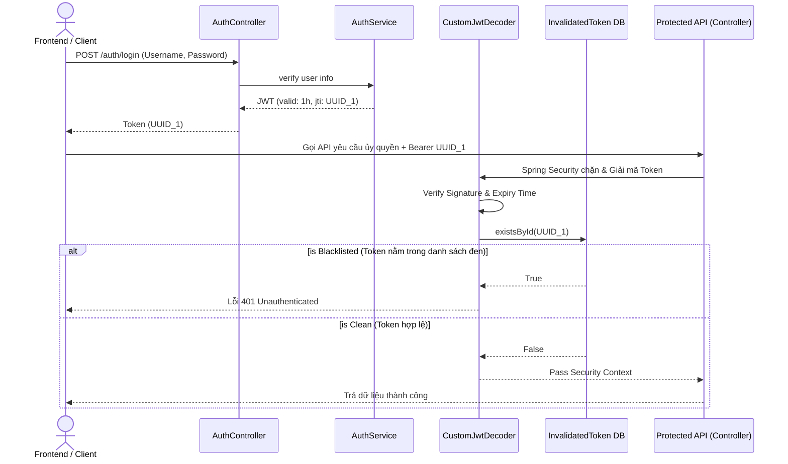
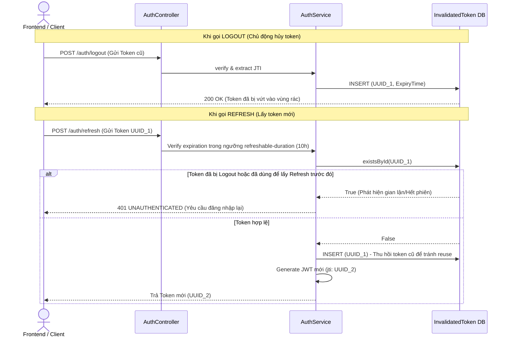

# Sơ đồ Luồng Vòng Đời JWT (JWT Lifecycle Flow)

Tài liệu này mô tả kiến trúc xác thực và vòng đời của JWT Token trong hệ thống EduStream, bao gồm cơ chế cấp phát, kiểm duyệt và thu hồi Token.

## 1. Flow Xác Thực và Phân Quyền (Login & API Call)

Luồng này giải thích cách user đăng nhập và cách hệ thống bảo vệ các API dùng `@PreAuthorize`.

## 2. Flow Xử Lý Thu Hồi (Logout / Refresh)

Để chống chiếm quyền và duy trì phiên đăng nhập lâu dài cho người dùng một cách bảo mật, hệ thống áp dụng cơ chế Refresh Token và Logout với bảng danh sách đen `invalidated_token`.

## 3. Lý do áp dụng kiến trúc
- **Bảo mật tuyệt đối (Revocation):** JWT theo bản chất không thể thu hồi. Khi sử dụng bảng `InvalidatedToken` kết hợp `CustomJwtDecoder`, Server chặn ngay lập tức bất kỳ token nào lọt vào tay hacker nếu người dùng chủ động bấm gửi `/auth/logout`.
- **Phát hiện đánh cắp (Token Reuse Detection):** Khi user bấm `/auth/refresh`, JTI cũ sẽ tự vào Blacklist. Nếu hacker dùng token cũ để refresh lần 2, hệ thống sẽ chối từ.
- **Tối ưu Server:** Không cần lưu danh sách mọi token đang "sống", Server chỉ lưu token rác. Mức độ query vào DB bằng `existsById` tốn nguồn lực cực thấp. Dữ liệu rác này có thể lập lịch định kỳ xóa dọn dựa trên `ExpiryTime`.
