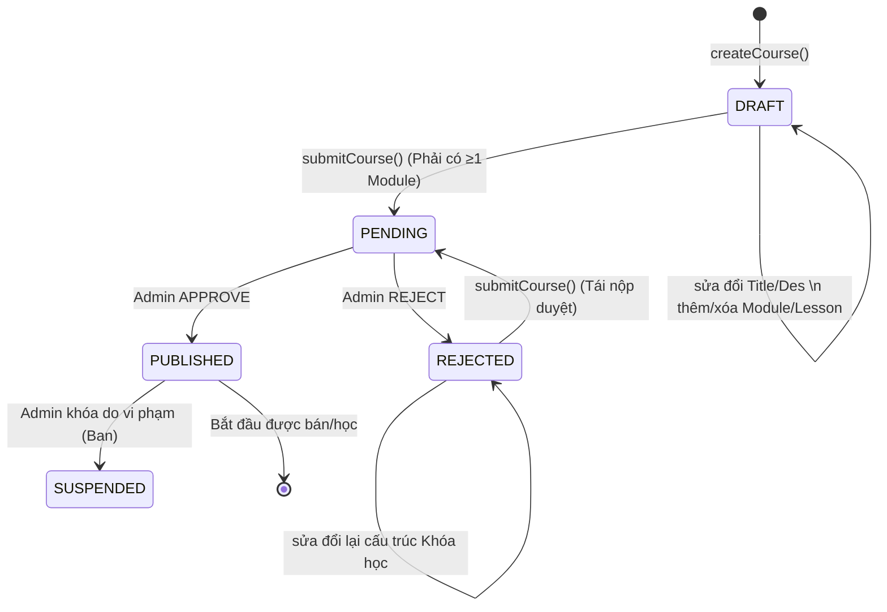

# Luồng Nghiệp Vụ: Quản lý và Khởi tạo Khóa Học (Course & Curriculum Management)

Tài liệu này mô tả chi tiết vòng đời của một Khóa học (Course), cấu trúc phân cấp học liệu, các ràng buộc nghiệp vụ và luồng gọi API từ giai đoạn "Tạo nháp" cho tới khi "Xuất bản lên sàn".

---

## 1. Cấu trúc Học Liệu (Curriculum Hierarchy)
Hệ thống học liệu của EduStream được xây dựng chặt chẽ theo cấu trúc Cây (Tree Architecture) 3 cấp độ để đảm bảo tính logic và dễ mở rộng:

```mermaid
graph TD
    C[Course (Khóa Học)] --> M1[CourseModule 1 (Chương 1)]
    C --> M2[CourseModule 2 (Chương 2)]
    
    M1 --> L1[Lesson 1 (Video)]
    M1 --> L2[Lesson 2 (Text/Bài đọc)]
    
    M2 --> L3[Lesson 3 (Video)]
    M2 --> L4[Lesson 4 (Kiểm tra)]
```

> [!NOTE] Cấu trúc MapStruct  
> Khi Frontend truy vấn chi tiết một Khóa học (`GET /api/tutor-courses/{id}`), backend thông qua MapStruct sẽ ghép nối đệ quy toàn bộ Cây này vào một khối JSON duy nhất, giúp giao diện App kết xuất ngay (Render) danh sách bài học mà không tốn nhiều lần gọi API rời rạc.

---

## 2. Các Vai Trò (Actors) Tham Gia
- **TUTOR (Gia sư)**: Người khởi tạo khóa học. Quản lý toàn quyền đối với các bài giảng do chính họ tạo ra nhờ cơ chế xác thực ranh giới sở hữu (Ownership Validation).
- **ADMIN (Quản trị viên)**: Người kiểm định chất lượng nội dung trước khi xuất bản khóa học ra thị trường, kiểm soát các nội dung vi phạm.

---

## 3. Các Trạng Thái Khóa Học (State Machine)

Tương tự cơ chế của Tutor Profile, cấu trúc phân quyền Khóa học hoạt động cực kỳ chặt qua enum `CourseStatus`:



> [!WARNING] Ràng Buộc Sửa Đổi (Status Lock-Down)
> Chỉ khi khóa học đang ở trạng thái `DRAFT` hoặc `REJECTED`, hệ thống mới mở cổng API cho phép chỉnh sửa nội dung bài học. Nếu cố tình Request API cấu hình bài học khi trạng thái là `PENDING` hoặc `PUBLISHED`, hệ thống sẽ trả về lỗi **400 Bad Request (Action not allowed for current course status)** để tránh đánh mất tính nguyên vẹn dữ liệu cho học viên đang học.

---

## 4. Luồng Giao Tiếp API (API Integration Flow)

### Giai đoạn 1: Chuẩn bị nội dung Khóa Học (TUTOR)
1. **Khởi tạo Khóa Học**: Frontend (Web/App) gọi `POST /api/tutor-courses`. Khóa học nhận status mặc định là `DRAFT`. API trả về ID Khóa học.
2. **Thêm Chương (Module)**: Góp nhặt ID Khóa học ở trên, Frontend gọi n-lần `POST /api/tutor-courses/{id}/modules` để đính kèm các chương bài (có gắn thuộc tính `orderIndex` để duy trì thứ tự sắp xếp). Trả về ID Module.
3. **Thêm Bài Học (Lesson)**: Sử dụng ID Module ở bước 2, gọi `POST /api/tutor-courses/modules/{moduleId}/lessons` để đẩy nội dung text hoặc URL Video vào.
4. **Nộp hồ sơ khóa học**: Bấm "Gửi Yêu Cầu Duyệt", gọi `POST /api/tutor-courses/{id}/submit`. Status biến thành `PENDING`. Khóa tính năng sửa.

### Giai đoạn 2: Xét Duyệt Khóa Học (ADMIN)
1. **Lấy danh sách hàng chờ**: Dashboard Admin gọi `GET /api/admin/courses/pending` để hiển thị các khóa học chờ lên sóng.
2. **Xác nhận**: Admin thao tác nút "Chấp nhận", gọi API `POST /api/admin/courses/{id}/verify?isApprove=true`. Khóa học đạt tới mốc cuối cùng `PUBLISHED`.

---

## 5. Security & Ownership Validation
> [!IMPORTANT] Bảo mật tài sản trí tuệ
> Trước bất cứ thao tác `UPDATE`, `ADD_MODULE`, `ADD_LESSON` hay `SUBMIT` nào của Tutor A, Backend sẽ kích hoạt một block hàm tàng hình có tên `verifyCourseOwnership(course)`. Hệ thống đối chiếu `userId` đang thao tác và ngầm đối khớp với Foreign Key `tutor_profile_id` lưu trong CSDL của Khóa học. Việc cố tình truyền ID giả để sửa bài giảng của Gia sư khác sẽ bị từ chối bằng lỗi **403 Forbidden (COURSE_OWNERSHIP_DENIED)**.
