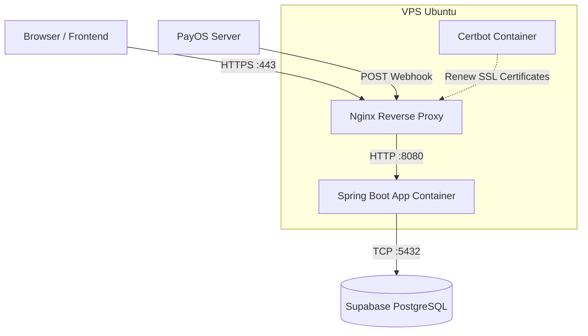
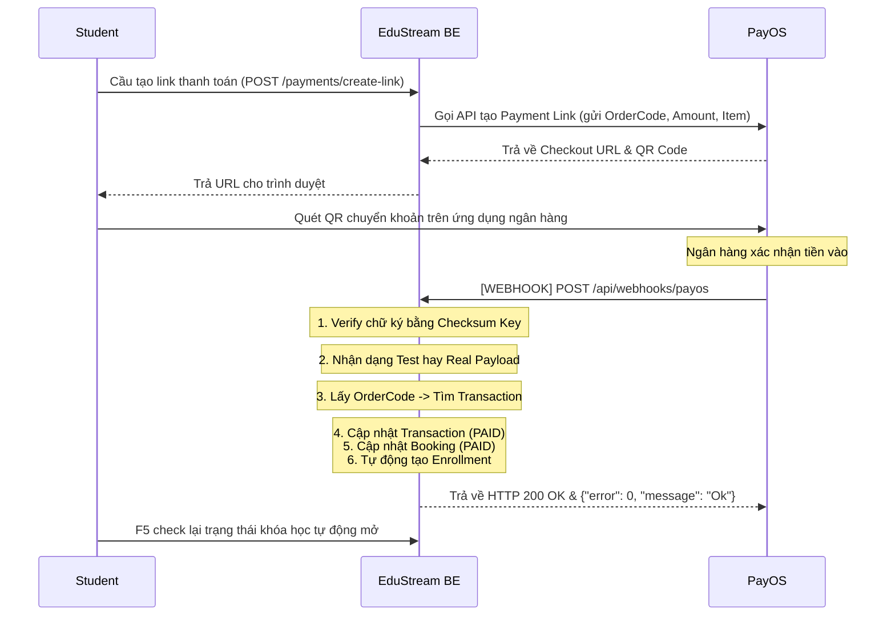

# Hướng dẫn Deploy và Luồng Webhook (PayOS)

Tài liệu này mô tả chi tiết cách hệ thống EduStream backend được deploy lên VPS (Ubuntu) sử dụng Docker, cũng như giải thích cách luồng Webhook của PayOS hoạt động trong thực tế.

---

## 1. Kiến trúc Deployment



Hệ thống sử dụng **Docker Compose** để chạy 3 container độc lập:
1. **app (`edustream-be`)**: Ứng dụng Spring Boot chạy trên openjdk/jre 21, chứa logic nghiệp vụ. Port nội bộ là 8080.
2. **nginx**: Reverse proxy đứng trước nhận toàn bộ request (HTTP 80 và HTTPS 443). Đóng vai trò điều hướng routing và mã hóa SSL.
3. **certbot**: Chạy ngầm định kỳ (mỗi 12 tiếng), có nhiệm vụ tự động gia hạn SSL certificate từ Let's Encrypt trước khi hết hạn.

### Môi trường và Biến (Environment Variables)
Ứng dụng đọc file `.env.production` (nằm trực tiếp trên VPS, không push lên git vì chứa secret). Các biến quan trọng:
- Thông tin DB: `DB_HOST`, `DB_PORT`, `DB_NAME`, `DB_USERNAME`, `DB_PASSWORD`.
- Secret cho Auth: `JWT_SIGNER_KEY`.
- Tích hợp thanh toán: `PAYOS_CLIENT_ID`, `PAYOS_API_KEY`, `PAYOS_CHECKSUM_KEY`.

---

## 2. Quy trình Deploy (Cập nhật Code lên VPS)

Khi có code mới tự code tại local, quy trình chuẩn để đưa lên VPS như sau:

**Bước 1: Commit và push code tại Local**
```bash
git add .
git commit -m "feat/fix: mô tả nội dung"
git push
```

**Bước 2: Pull code và Rebuild trên VPS**
```bash
# 1. SSH vào VPS
ssh root@YOUR_VPS_IP

# 2. Di chuyển vào thư mục dự án
cd /opt/edustream1-be

# 3. Kéo code mới nhất từ nhánh chính
git pull

# 4. Build lại container (Spring Boot sẽ compile thông qua maven container)
docker compose up -d --build

# 5. Theo dõi log khởi động để đảm bảo app không gặp lỗi
docker logs edustream-be -f
```

---

## 3. Luồng hoạt động của Webhook PayOS

Webhook là cơ chế PayOS "báo cáo" kết quả cho server của chúng ta một cách chủ động (bất đồng bộ) ngay khi học viên thanh toán chuyển khoản thành công.

### 3.1. Sơ đồ Luồng (Sequence Diagram)



### 3.2. Cấu hình chi tiết Webhook trong Controller
Nằm tại `WebhookController.java` và `PaymentService.java`.

- Payload được PayOS bắn về dưới dạng JSON, được Spring nhận dưới dạng `ObjectNode`.
- Chữ ký điện tử (Signature) được tích hợp trong payload sẽ được `payOS.webhooks().verify(body);` kiểm tra tính toàn vẹn (để tránh rủi ro bảo mật hacker tự gọi api webhook).

### 3.3. Xử lý "Test Webhook" của PayOS Dashboard
Trong bảng cấu hình Webhook ở trang quản trị PayOS, có một nút gửi webhook giả để kiểm tra mạng lưới.
- Dữ liệu giả (mock data) thường sẽ có mô tả là `"test webhook"` hoặc `orderCode = 123`.
- EduStream Backend đã có logic bắt điều kiện này:
  - Nếu là data thật: Đi kiểm tra DB, cập nhật Payment, Booking, tạo Enrollment đăng ký học.
  - Nếu là data giả (Test): Backend chỉ log lại ra console và tiến hành báo cáo ngay lập tức HTTP `200 OK` + `{"error":0}` để màn hình PayOS Dashboard báo test thành công. Mọi ngoại lệ hay `AppException(Not Found)` sẽ không bị ném ra ngăn chặn phản hồi nữa.

---

## 4. Quản lý lỗi (Troubleshooting) thường gặp

1. **Test Payload Failed (Lỗi 400)**: Do mã orderCode test (như `123`) không tồn tại trong CSDL server, framework ném ra lỗi `Not Found` -> Catch 400. **Đã được Fix** trong bản release mới nhất.
2. **Sai thông tin DB PostgreSQL**: Ứng dụng sẽ báo lỗi ngay khi khởi động (`docker logs edustream-be`). Cần kiểm tra lại tham số bên trong `nano .env.production`.
3. **SSL/Nginx (Nginx restarting loop / 502 Bad Gateway)**: Nếu container Backend sập, Nginx sẽ báo lỗi cổng 502 khi vào API domain, kiểm tra log BE.
4. **Không kết nối được API do bị chặn**: Kiểm tra tường lửa bằng `sudo ufw status`. Cần đảm bảo có dòng `80` và `443` (ALLOW).
