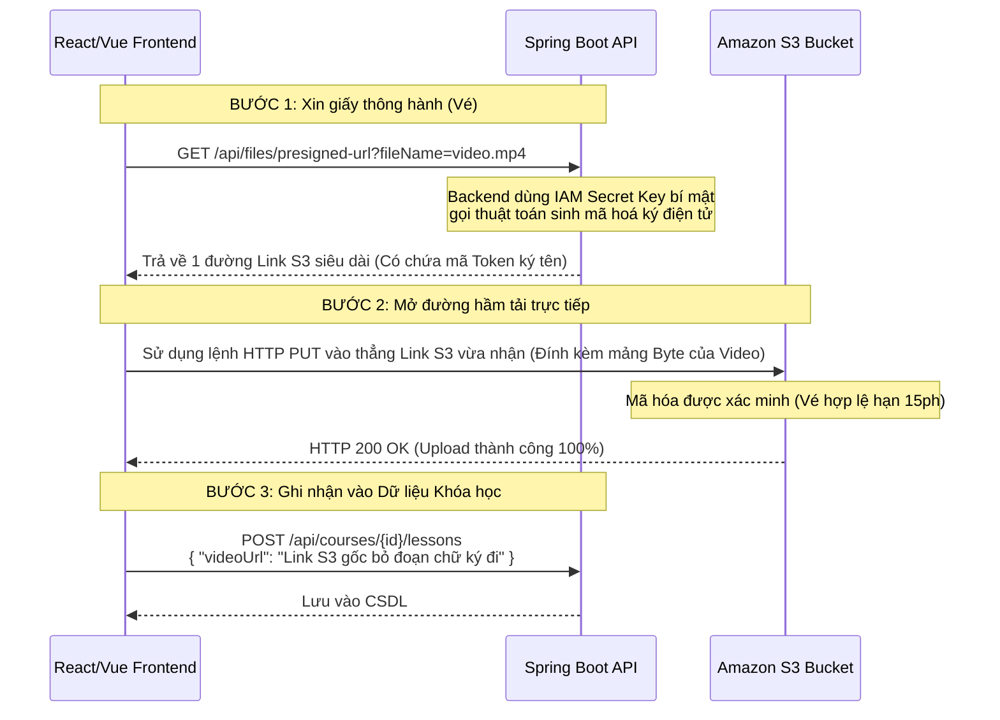

# Luồng Tích hợp Lưu trữ Đám mây (S3 Media Storage Flow)

Tài liệu này giải thích chi tiết cơ chế hoạt động của tính năng Upload File bằng Presigned URL và tại sao nó lại là phương pháp tối ưu nhất cho hệ thống VOD (Video-On-Demand).

---

## 1. Vấn đề của cách làm truyền thống
Thông thường, khi xây ứng dụng tải file, người ta sẽ thiết kế như sau:
`Frontend (Trình duyệt) -> Gửi File 2GB qua mạng -> Backend (Spring Boot) -> Nhận File, lưu tạm vào RAM/Ổ cứng -> Đẩy tiếp 2GB đó lên Amazon S3`.

**Nhược điểm chí mạng:**
- Bạn mất x2 băng thông mạng (1 lần tải lên VPS, 1 lần từ VPS đẩy sang Amazon).
- VPS cấu hình yếu (Ram 2GB) sẽ lập tức sập nguồn (Out of Memory - Lỗi 502) vì phải "cõng" 1 file video siêu to.
- Ngốn tiền cước băng thông chiều ra/vào của VPS một cách không cần thiết.

---

## 2. Giải pháp: Kỹ thuật Pre-signed URL (Đưa vé qua cổng)
Hệ thống EduStream áp dụng kiến trúc **Uỷ quyền**: Backend không động tay vào File, mà chỉ đóng vai trò phân phát "tấm vé thông hành".

### 2.1 Sơ đồ tuần tự (Sequence Diagram)

### 2.2 Vai trò của các thành phần
1. **IAM Keys (Trong `.env`)**: Chính là cờ lê, mỏ lết duy nhất có phôi gốc do Amazon cấp. Tuyệt đối không giao phôi gốc này cho Frontend React vì hacker sẽ F12 chôm được key. Do đó Backend sẽ giữ cẩn thận cái lõi này.
2. **S3Presigner**: Component sinh mã hóa SHA-256 dựa trên ngày giờ và tên file để khóa Link lại. Kẻ xấu lấy được link mà thay đổi file gốc thành file virus thì link sẽ tự động Vô hiệu hóa (Invalid Signature Error).
3. **UUID (Gắn trước tên file)**: Khắc phục sự cố 2 giáo viên cùng tải lên file tên là `bai1.png`. Hệ thống sẽ gắn cho nó 1 chuỗi ngẫu nhiên dài 36 ký tự trước tên gốc.

## 3. Tổng kết
Module S3 được triển khai vừa qua đã giải phóng 100% tài nguyên CPU và RAM của VPS ra khỏi cái bóng nặng nề của việc xử lý Video tĩnh, tập trung sức mạnh cho xử lý logic Database cực chuẩn của mô hình Cloud-Native Application hiện đại!
