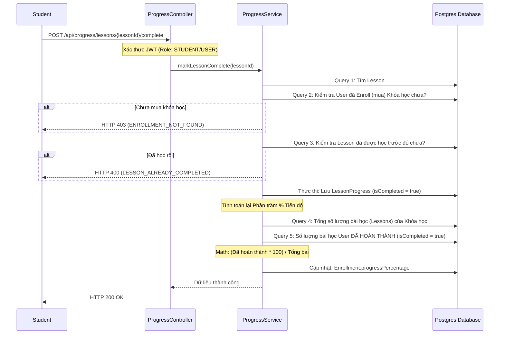

# Luồng Quản lý Tiến độ Học tập (Progress Tracking Flow)

Tài liệu này mô tả chi tiết cách hệ thống xử lý, lưu trữ và theo dõi tiến trình học bài của người dùng (Student), cùng với phương pháp kiểm thử (testing).

---

## 1. Cơ chế Hoạt Động (Architecture Flow)

Chức năng **Progress Tracking** liên kết giữa học viên (User) và từng bài giảng (Lesson). Nó đảm nhiệm việc theo dõi học sinh đã hoàn thành những bài nào để cập nhật thanh % tiến độ của toàn khóa học (Course Enrollment).

### 1.1 Sơ đồ luồng xử lý (Sequence Diagram)

### 1.2 Giải thích Cấu trúc Thực thi
- Hệ thống sử dụng một thực thể trung gian là `LessonProgress` với điều kiện ràng buộc duy nhất `UniqueConstraint(user_id, lesson_id)` ở tầng Database để ngăn không cho rác dữ liệu sinh ra khi User click đúp 2 lần.
- Con số `progressPercentage` (Mức độ hoàn thiện) được tính ngầm ở Server để chống việc Hacker/Client gọi API chủ động sửa `%` của mình lên 100%. Mọi con số đều được cam kết qua thuật toán trung thực đếm tổng bài.

---

## 2. Hướng dẫn Test API trên Swagger

Bạn có thể dễ dàng test sự liên kết mượt mà của tính năng này bằng **Swagger UI**.

**Điều kiện tiên quyết:**
1. Đã đăng nhập sinh viên, lấy JWT Token gắn vào ổ khóa (Authorize).
2. Sinh viên đã mua (hoặc đăng ký thành công) Khóa học.

**Các bước Test thực tế:**
1. Truy cập nhánh API **Progress API**.
2. Sổ API `POST /api/progress/lessons/{lessonId}/complete`.
3. Nhập ID của một Bài học (Lesson UUID) thuộc Khóa học bạn đã tham gia. Không cần truyền JSON Body.
4. Bấm **Execute**.
5. Nhận kết quả Báo cáo **Code 1000** ("Đánh dấu hoàn thành bài học thành công!").

*(Gợi ý: Nếu bạn chạy tính năng **Get My Enrollments**, bạn sẽ thấy `progressPercentage` của mình đã nhích lên số phần trăm dương thay vì 0% như lúc mới mua).*
