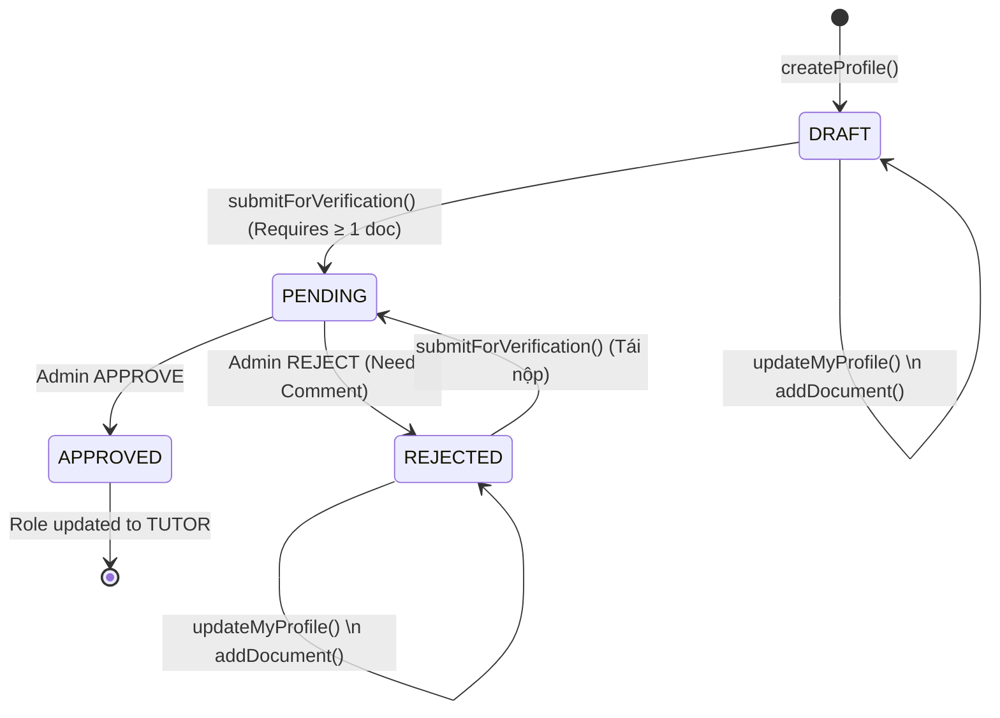

# Luồng Nghiệp Vụ: Đăng ký & Kiểm duyệt Gia sư (Tutor Profile & Verification)

Tài liệu này mô tả chi tiết vòng đời của một hồ sơ Gia sư (Tutor Profile), các trạng thái, và cách tương tác qua API.

---

## 1. Các Vai Trò (Actors) Tham Gia
- **STUDENT** (Học viên): Người dùng khởi tạo hồ sơ để xin làm Tutor. Họ có thể tạo, cập nhật, tải lên tài liệu và nộp hồ sơ.
- **ADMIN** (Quản trị viên): Người duyệt hồ sơ. Admin kiểm tra các thông tin và đánh giá xem hồ sơ có đáp ứng yêu cầu (Approve) hay bị từ chối (Reject).
- **TUTOR** (Gia sư): Sau khi hồ sơ được Approve, Student sẽ tự động đổi role thành Tutor, và sẵn sàng tạo Khóa học.

---

## 2. Các Trạng Thái Hồ Sơ (State Machine)

Status của một `TutorProfile` được thể hiện qua Enum `VerificationStatus` với các trạng thái sau:

* **DRAFT**: Trạng thái mặc định khi vừa tạo. Chỉ Student/Tutor mới có thể chỉnh sửa thông tin hoặc tải thêm giấy tờ.
* **PENDING**: Trạng thái sau khi Student bấm Nộp (Submit). Trong trạng thái này, hồ sơ bị khóa (không sửa được nữa), Admin sẽ vào xem xét duyệt.
* **REJECTED**: Bị Admin từ chối. Hồ sơ mở lại quyền sửa chữa. Student có thể bổ sung giấy tờ và nộp lại.
* **APPROVED**: Được Admin chấp thuận. Role được thăng cấp tự động.
* **BANNED**: Bị Admin cấm (dành cho quản lý gian lận sau này).

### Biểu đồ vòng đời (Lifecycle)

---

## 3. Luồng Giao Tiếp API (API Flow)

### Giai đoạn 1: Tạo và Xây dựng hồ sơ (Student)
1. **Khởi tạo**: Student gọi `POST /api/tutor-profiles` để tạo hồ sơ ban đầu. Hệ thống lưu thành `DRAFT`.
2. **Cập nhật (Tùy chọn)**: Nếu cần sửa text (Headline, Bio, Video), gọi `PUT /api/tutor-profiles/me`. API chỉ nhận những field thay đổi để tránh đè dữ liệu rỗng.
3. **Thêm tài liệu (Bắt buộc)**: Gọi `POST /api/tutor-profiles/documents` để đính kèm link CCCD/Bằng cấp (URL tới file). Có thể gọi nhiều lần để gắn nhiều tài liệu.
4. **Nộp hồ sơ (Submit)**: Gọi `POST /api/tutor-profiles/submit-verification`. Hệ thống bắt buộc phải có ít nhất 1 tài liệu. Hồ sơ sang `PENDING`.

### Giai đoạn 2: Admin Duyệt
5. **Danh sách chờ Duyệt**: Admin gọi `GET /api/admin/tutor-profiles?status=PENDING` để biết ai đang đợi duyệt.
6. **Xem chi tiết hồ sơ**: Gọi `GET /api/admin/tutor-profiles/{id}` để đọc nội dung text và xem toàn bộ link các document được đính kèm.
7. **Ra Quyết định (Verify)**: Gọi `POST /api/admin/tutor-profiles/{id}/verify`. Mọi hành động được Audit-Log vào bảng `verification_processes`.
   - **Nếu Action = APPROVED**: Hồ sơ sang `APPROVED`, role User cập nhật từ `STUDENT` sang `TUTOR`.
   - **Nếu Action = REJECTED**: Bắt buộc phải truyền `reviewComment` (Ví dụ: "Hình đại diện mờ"). Hồ sơ trở về trạng thái `REJECTED`. Người dùng nhận feedback để sửa.

---

## 4. Tích hợp với Frontend (Frontend Note)
1. **Quản lý Role tự động**: Khi gọi lệnh Login và Refresh token, hệ thống trả về Scope (role). Khi Admin bấm Approve, Frontend bên Client của user đó nếu đăng nhập lại sẽ nhận ngay role TUTOR.
2. **Upload Documents**: Backend KHÔNG chứa file Binary. Frontend tự upload tài liệu qua Presigned URL (AWS S3), nhận lại một Link Web hợp lệ. Sau đó pass cái Link Web đó vào API `POST /api/tutor-profiles/documents`.
3. **UI Trạng thái**: Frontend cần fetch trạng thái cấu trúc theo mã:
    - Nếu gọi api trả về `3002 (TUTOR_PROFILE_NOT_FOUND)` -> Dẫn User vào màn hình Tạo mới Profile (Onboarding step 1).
    - Nếu trả về profile nhưng `status = DRAFT / REJECTED` -> Hiển thị form cho phép Sửa và Thêm tài liệu.
    - Nếu `status = PENDING` -> Hiện 1 Lock screen báo "Hồ sơ đang chờ phê duyệt".
